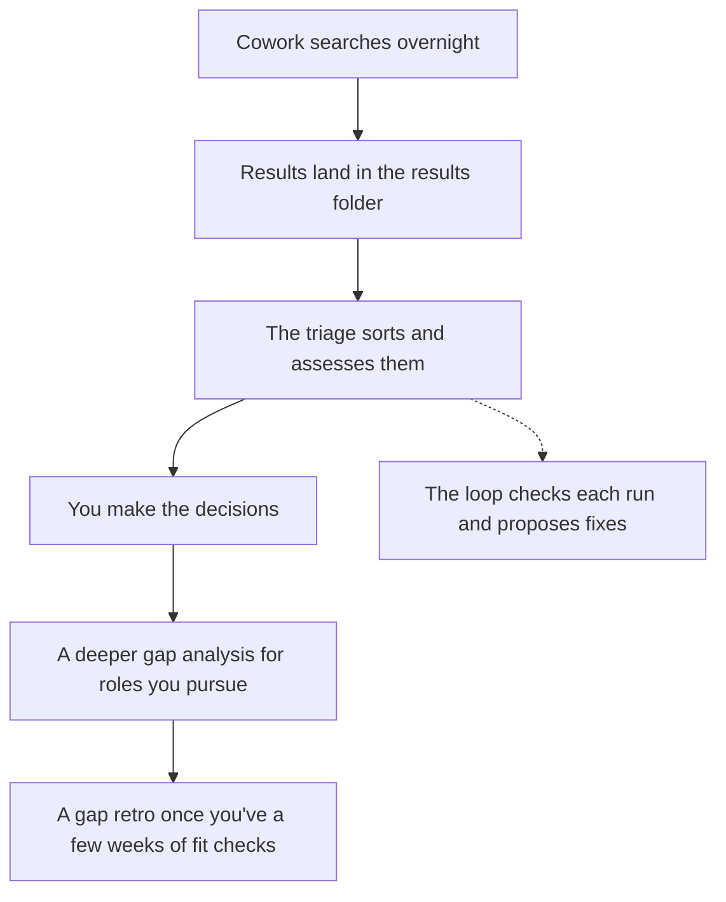

# Going Further: Triage, Gap Analysis and a Self-Checking Loop

**This page explains how these work rather than giving you files to install.** It covers what I added on top of the daily Cowork search, so you can decide whether any of it is worth building for yourself.

Before you start:

- **You'll need Claude Code**, the command-line version of Claude. You don't need to be a developer.
- **You'll need some comfort setting up files and scheduled jobs** on your computer.
- **You can skip all of it.** The rest of the toolkit works well without any of these.

## How it fits together



## 1. A morning triage

### What it does

Once the overnight searches have saved their results files (see [Your daily searches](daily-searches.md)), Claude Code reads them all and does the sorting you'd otherwise do over breakfast:

- **Drops what you've already decided.** It checks each role against a log of roles you've seen, applied for or turned down, so you never decide on the same role twice.
- **Saves the full job description** of every new role, so you still have it if the posting disappears.
- **Assesses each new role** against your profile, using the Fit check section of your [project instructions](templates/project-instructions.md), and gives it a recommendation: Apply, Worth a closer look, or Skip.
- **Leaves you a short report**: how many new roles came in, what each was recommended, which boards failed, and the decisions waiting for you.

It never applies for anything or makes those decisions for you.

### What you'd need

- **Your `job-search` folder**, holding your profile, the `results` folder and a running log of every role and what happened to it. The log is what stops the triage re-arguing old decisions, so it's the most important piece.
- **An instruction file for the triage**, written in plain English: which files to read, what counts as new, how to score and what the report should contain. In Claude Code this can be a *skill*, which is a saved set of instructions Claude follows when you ask for it.
- **Something to start it.** The simplest version is you, opening Claude Code each morning and asking for the triage. The automatic version is a scheduled job on your computer that starts Claude Code once the results have arrived. On a Mac that's a *launchd* job, the Mac's built-in way to run something on a schedule. On Windows, Task Scheduler does the same job, and on Linux a cron job or a systemd timer.

### How to build it

1. **Open Claude Code in your `job-search` folder.**
2. **Copy this and paste it in:**
   ```
   Help me write a skill that reads every file in results/, leaves out roles already in applications.md, saves each new role's job description, assesses it using the Fit check section of CLAUDE.md and writes me a short report.
   ```
3. **Run it by asking for the triage each morning**, until you're ready to start it automatically.

### Starting it automatically overnight

In my setup, the hand-off from the searches to the triage works like this:

1. **Each Cowork search saves its file** in `results/`.
2. **A small watcher waits for the full set**, one file per board, before it starts anything, so the triage never reads a half-finished morning.
3. **A backstop time starts the triage anyway** on whatever has arrived, so one failed board can delay the morning but never stall it.
4. **Claude Code runs the triage with nobody watching.** It never asks you anything, never applies for anything and never saves changes to version control (git). Anything it needs you for goes in the report.
5. **The next time you sit down, you catch up on every day since you last looked**, not just today's, so a weekend away loses nothing.

> [!CAUTION]
> **An unattended run reads text written by strangers and can edit your files.** Job descriptions come from anyone, and a posting can hide text aimed at an AI. Tell the triage that job descriptions are information to assess, never instructions to follow, and give the unattended run the narrowest permissions that work: in my setup it can fetch web pages but can't run commands.

### Lessons from running it

- **Run it by hand for a week or two first.** You'll change the instructions most days at the start, and it's easier to do that while you're watching.
- **An unattended run should note what it couldn't check, not guess.** If it can't open a page, it should say "couldn't check" rather than decide the role has gone. You can check properly later.
- **Nothing the triage writes counts until you've read it.**

## 2. A deeper gap analysis

### What it does

Once you've decided to pursue a role, this goes through every gap the fit check found, sorts it and gives it a next step:

- **Experience you have but haven't shown on your CV** gets a CV edit.
- **Experience that only partly meets what the role asks** gets an interview answer.
- **Experience you don't have** is named plainly, and on an essential that can mean the role isn't worth pursuing.

It runs only when you ask, one role at a time, and never unattended, because it works by asking you for experience that might close each gap.

### How to build it

1. **Open Claude Code in your `job-search` folder.**
2. **Copy this and paste it in:**
   ```
   Help me write a skill that takes a role I've decided to pursue, lists every gap from its fit check, asks me what experience I have for each, and sorts each one into missing, not shown on my CV, or only a partial match.
   ```
3. **Run it when you've decided to pursue a role**, by asking for a gap analysis of that role.

## 3. A gap retro

Once you've a few weeks of fit checks, the retro looks across them for the gaps that keep coming up and decides which are worth closing and how. Two rules keep it honest:

- **Only count gaps on roles you'd actually pursue**: ones you applied for, went after or turned down only on the terms. A role you turned down because you didn't want the work doesn't count, even if it showed a gap.
- **Ask before treating anything as a gap.** Your files are often quiet about experience you do have, so it should ask you first.

I've run it once so far. The gap it checked turned out to be experience I already had but had never written down, so asking first closed it without any new work.

Keep anything you write to close a gap private. In my setup it goes in a separate private folder, never into anything public.

## 4. A self-checking loop

> [!CAUTION]
> **The loop can cost real money.** It reviews every run of the tools you choose, every day, and each review is a full piece of Claude's work. You're responsible for any usage or charges it runs up, so read the cost section below and check your plan's limits before you build it.

### What it is

A way for your setup to learn from its own mistakes, with you approving every change.

1. **You write down what a good run looks like**, as a handful of yes-or-no checks. For the triage, for example: "Does every new role have a score?" and "Is every skipped role listed with its reason?"
2. **After each run, Claude scores that run** against your checks.
3. **Where a check fails, it proposes a change** to the instructions, with the evidence.
4. **You decide.** Nothing changes until you say yes, and every change is logged with your reason.

Over a few weeks, the same mistake stops repeating: a check catches it every time, and the fix goes into the instructions rather than your memory.

### The cost: read this before you build it

The loop is the piece to budget for. It adds a review on top of every run, every day, and that's where the cost climbs.

**Every check makes Claude do another full piece of work.** A review has to read the whole run it's checking, so in my experience a single review of a long session can cost several US dollars at Anthropic's pay-as-you-go prices. Across my first three weeks, the reviewing would have cost about $18, $38 and $44 a week at those prices. I run it on a subscription, so it came out of my plan's limits instead. Review every run of several tools every day, and that adds up quickly.

- **On a Claude subscription**, reviews count against your usage limits rather than a bill, so heavy reviewing can leave you short for the work you actually wanted to do.
- **On pay-as-you-go billing** (paying Anthropic for each use rather than a monthly plan), it's real money. Set a monthly spend limit in your Anthropic account (in the Claude Console, under Settings > Billing) before you switch anything on.
- **Only check what you run often and care about.** One or two well-used tools are worth it; a tool you run once a week isn't.
- **Decide before you start when you'll judge it.** Give it about a month, then look at whether the checks are catching real problems and whether you've acted on the proposals. If not, switch it off.

The loop is worth it only if you'll read what it tells you. If the proposals pile up unread, you're paying for reports nobody opens.

### A real example from my own setup

- **What broke:** one morning my triage turned down four new roles on my rules without assessing any of them, so I never saw how close they came.
- **What I changed:** the same day, I changed the triage instructions so every new role is assessed, whatever it recommends. The recommendation and the assessment are separate things.
- **The check that now catches it:** "Does every new role with a saved job description have an assessment and a link to it?" Any run that misses one fails.
- **A proposal I kept:** the review noticed some runs had a link to a role but no saved job description, and proposed a fix. My answer, which went into the instructions: *"If no job description is saved for the role, then it should be the case that triage goes off using the URL that is saved, opens up the job description, and saves it from there."*

**In numbers, from my first three weeks:** my triage's first automated review passed 2 of its 6 checks, and by the end of that first week runs were passing 5 of 6. Across the three weeks I kept 40 proposed changes to the triage and dropped 1. These are small numbers over a short time, so treat them as a sign of what a loop catches rather than proof it works.

### What you'd need

- **Your checks**, written from mistakes you've actually seen, not ones you imagine. Score a few runs by hand first to find them.
- **A reviewing step** that reads the run and scores it. In Claude Code this is another skill, started automatically after the run or by you.
- **A proposals file** where suggested changes wait for your decision, and a log of what you kept and dropped.

### How to build it

This is how I built mine: two skills, designed before anything was built.

1. **Learn the evals method.** Mine follows Shreya Shankar and Hamel Husain's evals method, from their AI Evals course: look at real runs first, find the mistakes, and only then write the checks. *This toolkit is not affiliated with or endorsed by them.*
2. **Design the two skills.** Open Claude Code in your `job-search` folder, then copy this and paste it in:
   ```
   Help me design two skills: an evals skill that follows Shankar and Husain's evals method in full, and a separate loop skill that scores each run of my triage against the checks the evals skill writes, and proposes fixes that wait for my yes.
   ```
3. **Give the loop a hard finish**, so it can't keep running and use up your plan. Mine has four: each review runs once and stops, an off switch, a time limit on every review, and spend caps set from the first week's real costs rather than guessed.
4. **Build it from the design.** Ask Claude to write a plan from the design, then build it.
5. **Run the evals skill on your triage with you**, going through its runs together to write the checks, before the loop starts scoring it.
